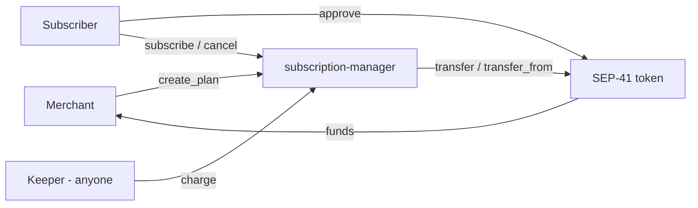
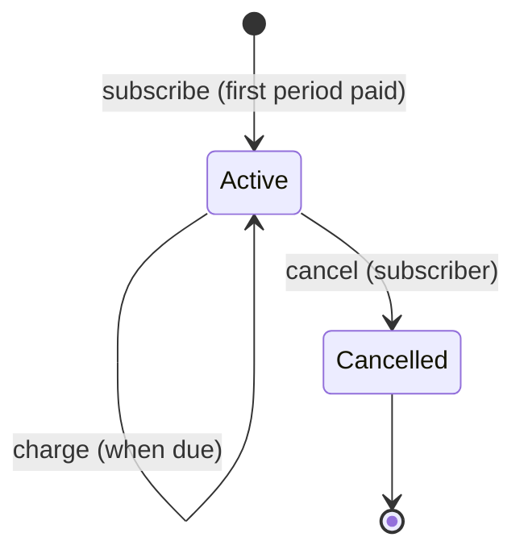

# Architecture

## Goals

1. Make recurring payments a reusable Soroban primitive for any SEP-41 token.
2. Keep custody with the subscriber: the contract never holds funds.
3. Stay small and auditable: one contract, no admin keys, no upgrade path in v0.1.

## Non-goals (v0.1)

Fiat on/off-ramps, invoicing, proration, trials, usage-based billing, off-chain notifications. See the [roadmap](ROADMAP.md).

## Components

| Component              | Role                                                           |
| ---------------------- | -------------------------------------------------------------- |
| `subscription-manager` | Stores plans and subscriptions, enforces schedule and status.  |
| SEP-41 token           | Holds balances and allowances; executes the actual payment.    |
| Keeper (off-chain)     | Optional bot that calls `charge`. Not trusted; no privileges.  |

## Lifecycle

A plan may be deactivated by its merchant at any time. A deactivated plan accepts no new subscribers and none of its subscriptions can be charged; subscriptions remain `Active` in storage.

## Payment flow

1. `subscribe` calls `token.transfer(subscriber, merchant, amount)` under the subscriber's authorization.
2. The subscriber separately calls `token.approve(subscriber, contract, allowance, live_until_ledger)`.
3. `charge` calls `token.transfer_from(spender = contract, from = subscriber, to = merchant, amount)`. The allowance caps total exposure and expires on its own.
4. If the transfer fails, `charge` returns `PaymentFailed` and no state changes.

## Scheduling rules

- `next_charge = subscribe_time + period` at enrolment.
- On a successful charge: `next_charge += period`. If that is still in the past, the schedule resets to `now + period`. Missed periods are never back-billed.
- `charge` before `next_charge` returns `NotDue`.

## Storage layout

| Key                | Storage    | Value          | Notes                         |
| ------------------ | ---------- | -------------- | ----------------------------- |
| `PlanCount`        | instance   | `u64`          | Last issued plan id           |
| `SubCount`         | instance   | `u64`          | Last issued subscription id   |
| `Plan(plan_id)`    | persistent | `Plan`         | TTL extended on read/write    |
| `Sub(sub_id)`      | persistent | `Subscription` | TTL extended on read/write    |

TTLs: threshold 15 days, extend to 30 days (in ledgers, assuming ~5s ledgers).

## Authorization model

| Function          | Auth                     |
| ----------------- | ------------------------ |
| `create_plan`     | merchant                 |
| `deactivate_plan` | plan's merchant          |
| `subscribe`       | subscriber               |
| `cancel`          | subscription's subscriber |
| `charge`          | none (permissionless)    |

`charge` is safe to leave open because the destination, amount and timing are fixed by the plan and the schedule, not by the caller.

## Security considerations

| Risk | Mitigation / status |
| ---- | ------------------- |
| Merchant over-charging | Amount fixed in plan; one charge per period; bounded by subscriber allowance. |
| Stale approvals after cancel | `cancel` stops charges in this contract, but allowances persist on the token. Clients should revoke with `approve(..., 0, ...)`. Tracked in the backlog. |
| Malicious token contract | A merchant can set any token address. Frontends must only offer vetted tokens. Allow-listing is on the roadmap. |
| Keeper griefing | Failed charges revert cleanly. No funds or state at risk. |
| Time manipulation | Uses ledger timestamp, which validators cannot skew meaningfully relative to a 1-hour minimum period. |
| Storage expiry | Entries extend TTL on use. A subscription not touched for >30 days may archive and must be restored. Tracked in the backlog. |
| Upgrades / admin | None in v0.1 by design. |

## Design decisions

- **One contract, shared by all merchants**, rather than a factory of per-merchant contracts: simpler, cheaper, easier to audit. A factory model can be explored later.
- **First payment on subscribe** so merchants get paid immediately and the subscriber's balance is verified up front.
- **Skip missed periods** to avoid surprise multi-month charges after downtime.
- **Pull model via allowance** instead of escrow: no locked funds, no custody risk.
